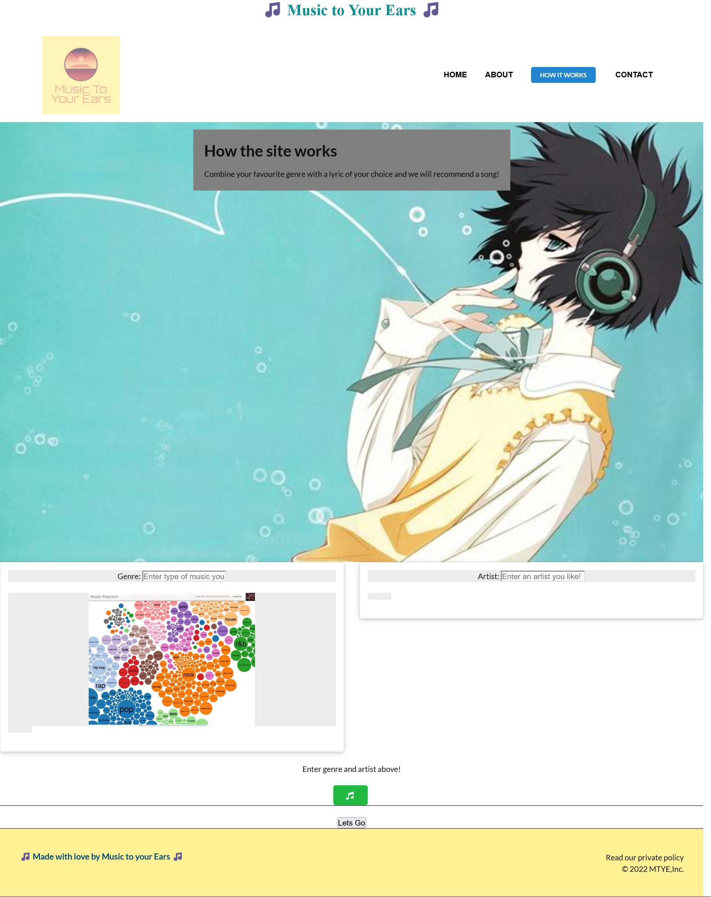
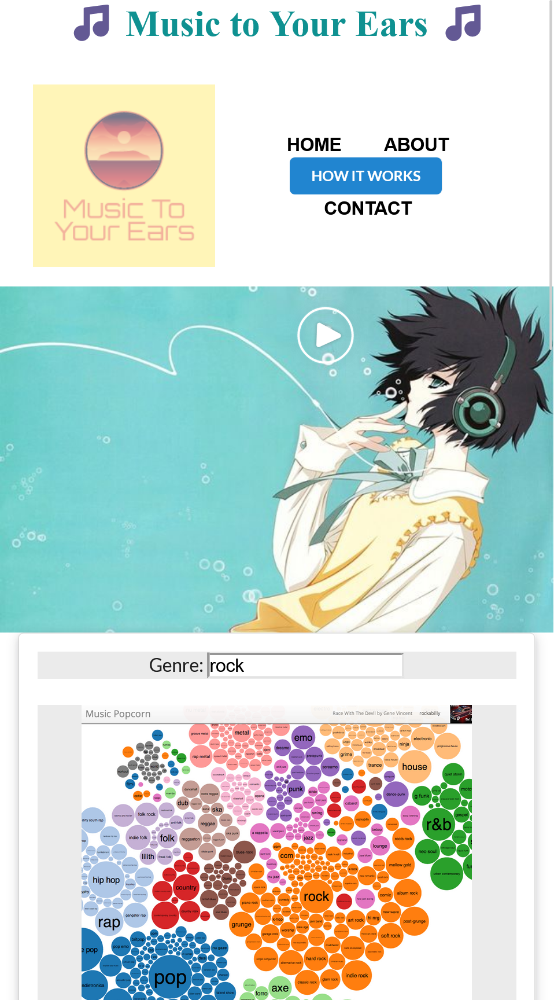
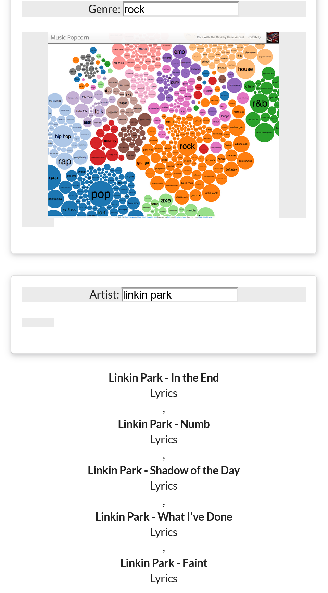
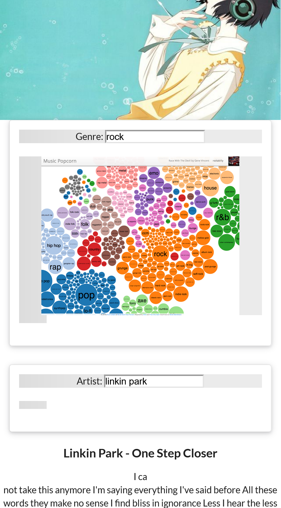

# project 1 - music app

## Index

1. [Description](#Description)

2. [Links](#Links)

3. [Code Description](#Code%20Description)

4. [Challenges](#Challenges)

5. [ScreenShots](#ScreenShots)

6. [Contributors](#Contributors)

7. [Badges](#Badges)

8. [Credits](#Credits)

## Description

This one is a project. Unlike Challenges it's a colab team work/effort on this one. Each team is tasked with creating a site using 2 APIs, modals instead of pop-ups and such, and html/css/java frameworks "other than bootstrap".

- We ended up deciding upon a music recommendations related product named (N/A). that would have ppl search for music per genre and then be recommanded for similar music of their liking. (submission version may or may not include features like lyrical descriptions, etc. currently...)

## Links

- [Deployed Link](--)

- [GitHub repo Link](https://github.com/)

## Code Description

We decided to use (for css - [Semantic UI](https://semantic-ui.com/) for framework "other than Bootstrap". And the APIs are ([musicbrainz(dot)com](https://musicbrainz.org), [lyrics(dot)ovh](https://api.lyrics.ovh/) & [lyrics(dot)com](https://www.stands4.com/services/v2/lyrics.php)).

- CSS→

      - Thankx to the SemanticUI framework the site was display responsive for smaller sizes (phones & tablets)
      - primary styles were added directly to html code as required for SemanticUI responsiveness.
      - A few other style properties were introduced through local css file for adjustments.

- JavaScript→

      ○ All scripting was done in the local js file.
        - Added parameters and functionalities for the apis to show result on the url page.
        - Added functionality for "background ambient music" to be playable.
        - Added functionality for a Modal to show up.

## Challenges

    - Spotify Api proved to be highly troublesome to use.
    - We had initially implmented a "background ambient music" to play when a play button was clicked and during Demo it played properly and as intended. but later on it simply wouldnt work no matter what we did (made sure the images,media linkings were proper along with the script and later on changed script to try a diff approach)...
    - Colaboration was constantly hindered by time clashes either due to job timings or other reason's for unavailability. But we still made it happen despite the time constraints other than the presentation deadline.

## ScreenShots

## Contributors

- [Alex Jaimes](https://github.com/AlexJCturbo)

- [Sam Rankin](https://github.com/Rankin47)

- [A-N26](https://github.com/A-N26)

- [Damon Paoletti](https://github.com/damonpaoletti)

- []

## Badges

## Credits

- [A-N26](https://github.com/A-N26)

- [Alex Jaimes](https://github.com/AlexJCturbo)

- [Sam Rankin](https://github.com/Rankin47)

- [Damon Paoletti](https://github.com/damonpaoletti)
